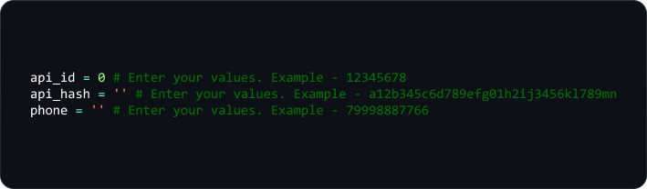

<h1 align="center">
  TGParse
</h1>

<p align="center">
  
</p>

<p align="center">
      
</p>

# About

TGParse - is a program on Python, that parse Telegram chat users and make a csv file with them. TGParse is working like a userbot, it enters your Telegram account and after that you need to choose a chat or a channel that you want to parse.

You can parse any chats in which you are a member. You can also parse channels, but only those in which you are an administrator and also must have less than 200 subscribers.

# Requirements

You need to install <code>python3</code> <i>(or just <code>python</code>)</i>, <code>git</code>, <code>python3-pip</code> <i>(or <code>python-pip</code>)</i> and <code>telethon</code> library.

# Installation

For :

Clone the repo:

```bash
git clone https://github.com/memb3r/TGParse
```

Move to <code>TGParse</code> folder:

```bash
cd TGParse
```

Installing <code>telethon</code>:

```bash
pip install telethon
```

# Usage

First, you need to open <code>tgparse.py</code>, change <code>api_id</code>, <code>api_hash</code> and <code>phone</code> variables and after that save the file:

<p>
  
</p>

Then, open <code>tgparse.py</code>:

```bash
python3 tgparse.py
# Or python tgparse.py, if you can't install python3
```

Now you must register. To do this, enter your phone number (or bot token), code (which was sent to your account) and two-factor authentication password (if you have one).

That's all. Just enter a number of a chat, that you want to parse and press "Enter".

# License

This project is licensed under the <code>MIT License</code> - see file [LICENSE](LICENSE) for details.
